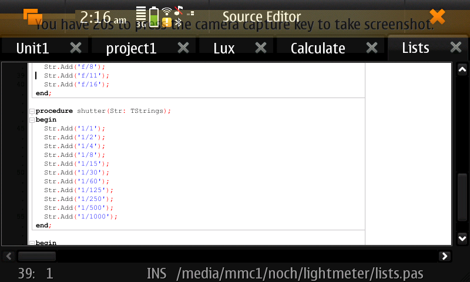
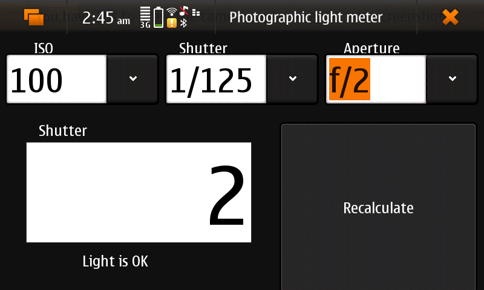

# photolightmeter

maemo photographic light meter which calculates aperture, shutter values.

# history
initially was written for nokia n900 and nokia n810, ran under maemo fremantle and maemo diablo.

https://garage.maemo.org/frs/?group_id=2065

https://talk.maemo.org/showthread.php?t=69329

https://talk.maemo.org/showthread.php?t=69804

later was ported to android, see android branch - only one function changed - how to get data from lightmeter.

works on desktop!

here how it looks in maemo menu now

other screenshots

